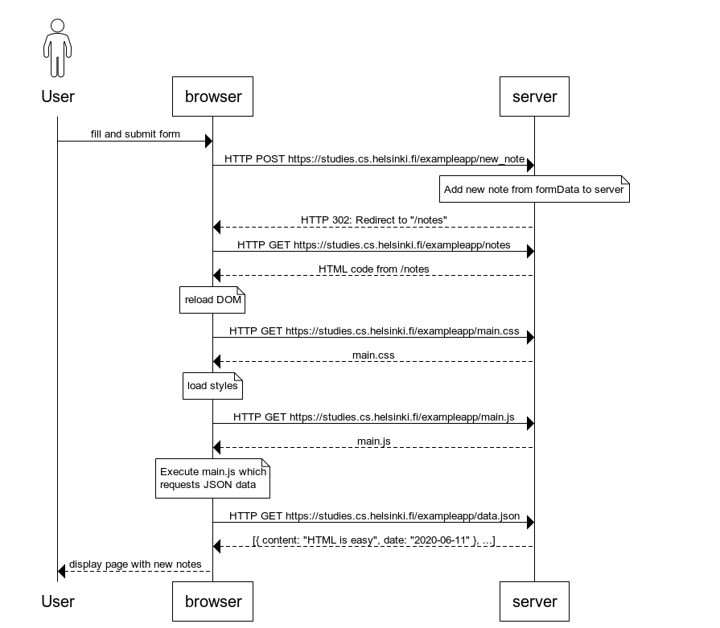
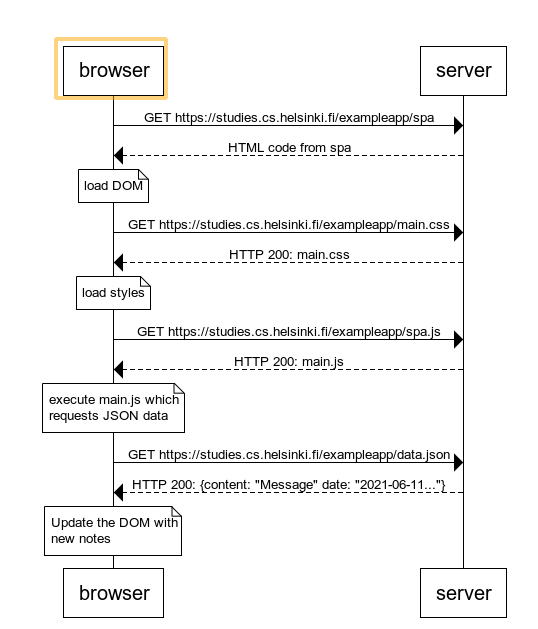
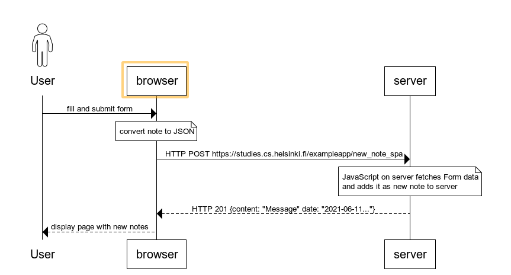

# Full Stack Open 2020 - Exercise Solutions

## Part 0 - [Fundamentals of Web Apps](https://fullstackopen.com/en/part0)

In this part, we will familiarize ourselves with the practicalities of taking the course. After that we will have an overview of the basics of web development, and also talk about the advances in web application development during the last few decades.

## [Exercise Description](https://fullstackopen.com/en/part0/fundamentals_of_web_apps#exercises-0-1-0-6)

### 0.4: new note:

### 0.5: Single page application

### 0.6: New note:

